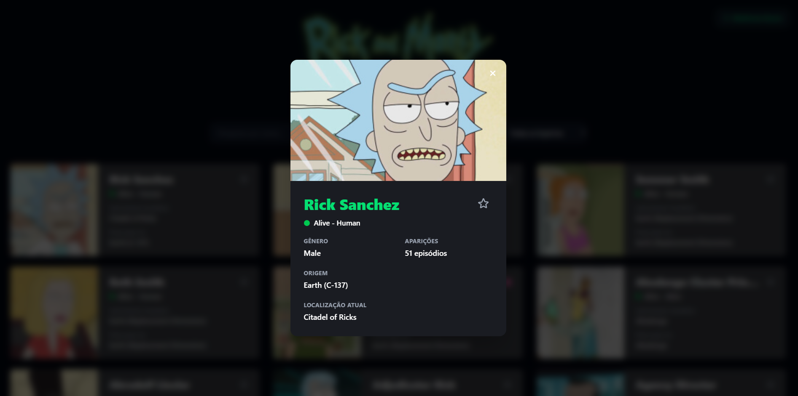

# Rick and Morty API Explorer 

Aplicação web moderna para exploração do universo de Rick and Morty, desenvolvida com foco em Clean Code e testabilidade. O sistema permite navegar por personagens, visualizar detalhes em tempo real e gerenciar uma lista de favoritos com persistência.

# Acesse o Projeto
https://rickandmortyt.netlify.app/



# Funcionalidades
```bash
Exploração Dinâmica: Listagem de personagens com busca e navegação intuitiva.
Detalhes Profundos: Modal interativo com informações detalhadas e estatísticas do personagem.
Sistema de Favoritos: Gerenciamento de favoritos com contexto global (Context API), permitindo salvar seus personagens preferidos.
Persistência de Dados: Integração com o navegador para manter a lista de favoritos intacta entre sessões.
Design Responsivo: Interface moderna, adaptada para dispositivos móveis e desktops.
```

# Tecnologias
```bash
React + TypeScript: Tipagem forte e desenvolvimento orientado a componentes.
Vite: Build tool focada em performance.
Tailwind CSS: Design system responsivo e estilização utilitária.
Axios: Cliente HTTP para comunicação com a API.
React Query (@tanstack/react-query): Gerenciamento de estado de servidor, cache, sincronização e estados de loading/erro.
Vitest + React Testing Library: Suíte de testes com foco em alta cobertura.
Context API: Gerenciamento de estado global para favoritos.
Netlify: Hospedagem da aplicação com suporte a configurações personalizadas de roteamento (proxy/redirects).
```

# Desafios Técnicos Superados
```bash
Garantia de Estabilidade (Testes)
O maior desafio foi elevar a cobertura de testes para um nível profissional (>90% de linhas). A implementação de testes de branch coverage permitiu mapear comportamentos críticos, como o tratamento de dados ausentes na API e a alternância de estados no modal, garantindo que a aplicação não quebre em situações inesperadas.

Gestão de Estado e Ciclo de Vida
A integração do FavoritesContext com o ciclo de vida dos componentes exigiu um controle rigoroso para evitar renderizações desnecessárias e garantir que a interface sempre reflita o estado real do localStorage.

Otimização de Infraestrutura: Configuração de regras de redirecionamento (proxy) no Netlify para contornar restrições de CORS da API externa e otimizar o tempo de resposta das requisições.

Otimização de Performance e Cache: Utilização do React Query para otimizar o consumo da API, reduzindo requisições desnecessárias através do cache inteligente e melhorando a experiência do usuário com estados de carregamento (loading states) fluidos e tratamento automático de erros.
```

# Instalação e Como Rodar

```bash
# Clone o repositório
git clone https://github.com/lehwees/rick-and-morty
```
```bash
cd rick-and-morty
```
```bash
# Instale as dependências
npm install
```
```bash
# Inicie o projeto
npm run dev
```
```bash
# Execute os testes
npm run test
```

# Melhorias Futuras
Implementação de um sistema de "Error Boundary" para capturar falhas na renderização.
Adição de paginação infinita para otimizar o carregamento de grandes volumes de personagens.

## 
Desenvolvido com foco em escalabilidade e experiência do usuário.

